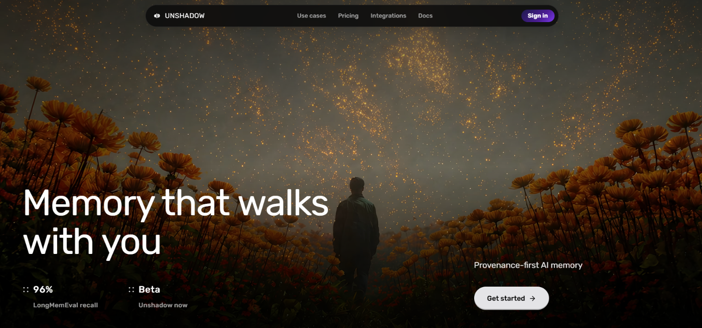
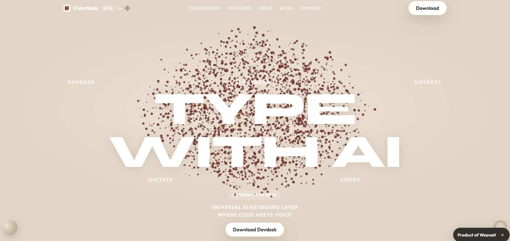
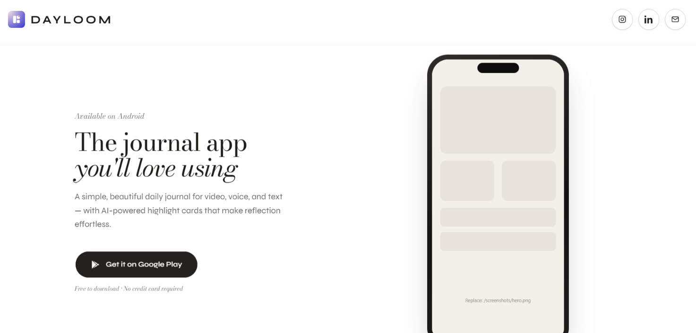
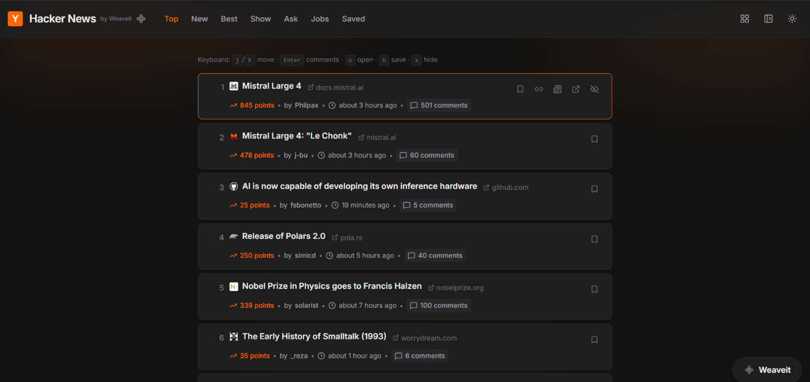
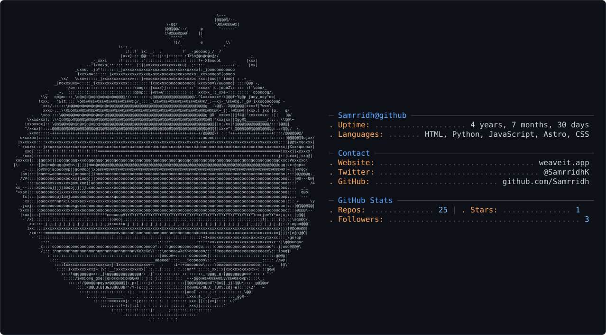

# Hey, I'm Samrridh

Building products across **AI, developer tools, and consumer software.**

Currently focused on **AI memory, agent interfaces, and software that makes everyday workflows better.**

 

&nbsp;&nbsp;&nbsp;&nbsp;

&nbsp;&nbsp;&nbsp;&nbsp;

&nbsp;&nbsp;&nbsp;&nbsp;

&nbsp;&nbsp;&nbsp;&nbsp;

 

## Currently

|                   |                                                                    |
| ----------------- | ------------------------------------------------------------------ |
| **Building**      | Provenance-first AI memory and AI-powered productivity software    |
| **Exploring**     | Agent interfaces · Memory systems · Retrieval · Multimodal context |
| **Interested in** | Developer tools · Open source · Self-hosting · Consumer software   |
| **Learning**      | Distributed systems · ML systems · Retrieval architectures         |

 

## Selected Work

<table>
<tr>

<td width="50%" valign="top">

### Unshadow

**Provenance-first memory for AI.**

Capture knowledge with its source and reuse durable context across AI assistants and applications.

`AI Memory` `Provenance` `Agents` `Context`

 

[**Visit Unshadow ↗**](https://unshadow.dev/)

</td>

<td width="50%" valign="top">

### Devdesk

**Turn your normal keyboard into an AI workflow keyboard.**

A free software alternative to dedicated AI input hardware for launching agents and reusable AI workflows.

`AI Agents` `Automation` `Productivity` `Developer Tools`

 

[**Open Devdesk ↗**](https://devdesk.unshadow.dev/)

</td>

</tr>

<tr>

<td width="50%" valign="top">

### Dayloom

**Video micro-journaling for people who don't like to journal.**

Capture short moments instead of writing long diary entries and build a visual record of your life.

`Video` `Journaling` `Consumer App` `AI`

 

[**Visit Dayloom ↗**](https://dayloom.xyz/)

</td>

<td width="50%" valign="top">

### Revamped Hacker News

**A modern interface for Hacker News.**

A cleaner reading and browsing experience while keeping the information density that makes Hacker News useful.

`Hacker News` `Frontend` `UX` `Web`

 

[**Open Hacker News ↗**](https://hn.unshadow.dev/)

</td>

</tr>

<tr>

<td width="50%" valign="top">

### SnapRank

**Make tier lists together in real time.**

Upload items, drag them between tiers, and rank anything with friends using live WebSocket synchronization.

`WebSockets` `Real-time` `Drag & Drop` `Multiplayer`

 

[**GitHub ↗**](https://github.com/Samrridh/SnapRank)

</td>

<td width="50%" valign="top">

### Clipper

**A lightweight, memory-conscious clipboard manager.**

Searchable history, pinning, deduplication, persistent storage, and automatically expiring sensitive clipboard items.

`Python` `Desktop` `Clipboard` `Utility`

 

[**GitHub ↗**](https://github.com/Samrridh/Clipper)

</td>

</tr>
</table>

 

## Technologies

### Languages

  

### Web & Application Development

  

### Infrastructure & Data

  

### Tools

  

<strong>More technologies I've worked with</strong>

 

**Frontend & UI**

Bootstrap · DaisyUI · Radix UI · Three.js · p5.js · Gatsby · WordPress · Gutenberg

**Backend & APIs**

Socket.IO · JWT · Apache · Expo · Tauri

**Data & ML**

NumPy · Pandas · scikit-learn

**Infrastructure**

DigitalOcean · OVH · GitLab CI · Playwright · Sentry

**Self-hosting & Networking**

Home Assistant · Jellyfin · Pi-hole · WireGuard · Raspberry Pi

**Other**

Canva · Adobe XD · ESLint · Tampermonkey

 

## Demos & Writing

I occasionally share product demos, experiments, and things I'm learning while building.

&nbsp;
<a href="https://www.youtube.com/@samrridh.khanna"><strong>YouTube ↗</strong></a>

<!--

Later you can replace the text above with actual content:

<table>
<tr>

<td width="50%" valign="top">

### Building provenance-first AI memory

How Unshadow stores memories together with where they came from.

[Watch ↗](YOUR_VIDEO_URL)

</td>

<td width="50%" valign="top">

### Designing AI-native developer tools

Thoughts on agent interfaces, workflows, and removing friction from AI tools.

[Read ↗](YOUR_ARTICLE_URL)

</td>

</tr>
</table>

-->

  

<picture>
  <source media="(prefers-color-scheme: dark)" srcset="./dark_mode.svg" />
  <source media="(prefers-color-scheme: light)" srcset="./light_mode.svg" />
  
</picture>