&nbsp;&nbsp;&nbsp;&nbsp;

&nbsp;&nbsp;&nbsp;&nbsp;

&nbsp;&nbsp;&nbsp;&nbsp;

&nbsp;&nbsp;&nbsp;&nbsp;

  

### Building AI systems, developer tools, and infrastructure.

Exploring **AI memory, agents, retrieval, long-term context, and self-hosted systems.**

 

  

 

---

## Currently

<table>
<tr>
<td width="150"><strong>Building</strong></td>
<td>AI memory infrastructure and developer-focused products</td>
</tr>
<tr>
<td><strong>Exploring</strong></td>
<td>AI agents · Retrieval · Long-term context · Memory architectures</td>
</tr>
<tr>
<td><strong>Interested in</strong></td>
<td>Developer tools · Open source · Infrastructure · Self-hosting</td>
</tr>
<tr>
<td><strong>Learning</strong></td>
<td>Machine learning · Distributed systems · Applied AI</td>
</tr>
</table>

---

## Selected Work

<table>
<tr>
<td width="50%" valign="top">

### Unshadow

**Long-term memory infrastructure for AI.**

A memory layer for AI applications designed to retain, retrieve, and reason over useful information across conversations and applications.

 

`AI Memory` · `Python` · `FastAPI` · `LLMs`

 

[Repository ↗](https://github.com/) &nbsp;&nbsp; [Website ↗](https://unshadow.dev)

</td>

<td width="50%" valign="top">

### Agent Lab

**Experiments with autonomous AI systems.**

Experiments around tool-using agents, model orchestration, contextual retrieval, memory, and autonomous workflows.

 

`Python` · `LLMs` · `Agents` · `Docker`

 

[Repository ↗](https://github.com/) &nbsp;&nbsp; [Demo ↗](#)

</td>
</tr>

<tr>
<td width="50%" valign="top">

### Memory Bench

**Evaluating long-term memory for AI systems.**

Experiments and benchmarks for measuring retrieval quality, memory relevance, latency, recall, and long-term information retention.

 

`Python` · `ML` · `Retrieval` · `Vector Search`

 

[Repository ↗](https://github.com/)

</td>

<td width="50%" valign="top">

### Homelab Tools

**Tools and automations for self-hosted infrastructure.**

Utilities and experiments around Docker, networking, monitoring, infrastructure, servers, and home automation.

 

`Docker` · `Linux` · `Cloudflare` · `Networking`

 

[Repository ↗](https://github.com/)

</td>
</tr>
</table>

---

## Technologies

### Languages

  

### Web & Application Development

  

### Infrastructure & Data

  

### Tools

  

<strong>More technologies I've worked with</strong>

 

**Frontend & UI**

Bootstrap · DaisyUI · Radix UI · Three.js · p5.js · Gatsby · WordPress · Gutenberg

**Backend & APIs**

Socket.IO · JWT · Apache · Expo · Tauri

**Data & ML**

NumPy · Pandas · scikit-learn

**Infrastructure**

DigitalOcean · OVH · GitLab CI · Playwright · Sentry

**Self-hosting & Networking**

Home Assistant · Jellyfin · Pi-hole · WireGuard · Raspberry Pi

**Other**

Canva · Adobe XD · ESLint · Tampermonkey

---

## Demos & Writing

I'm interested in documenting the systems I build, the decisions behind them, and experiments that don't necessarily become full projects.

<!--

When you have videos/articles, replace this section with something like:

<table>
<tr>
<td width="50%" valign="top">

### Building Long-Term Memory for AI Agents

A walkthrough of the architecture and experiments behind an AI memory system.

[Watch on YouTube ↗](https://youtube.com/...)

</td>

<td width="50%" valign="top">

### Why AI Memory Needs More Than Vector Search

Notes on retrieval, temporal relevance, memory consolidation, and long-term context.

[Read ↗](https://...)

</td>
</tr>
</table>

-->

<a href="https://www.youtube.com/@samrridh.khanna">
  YouTube ↗
</a>

---

## Elsewhere

&nbsp;&nbsp;&nbsp;&nbsp;

&nbsp;&nbsp;&nbsp;&nbsp;

&nbsp;&nbsp;&nbsp;&nbsp;

&nbsp;&nbsp;&nbsp;&nbsp;

  

<a href="https://linkedin.com/in/samrridh-khanna">LinkedIn</a>
&nbsp;·&nbsp;
<a href="https://x.com/SamrridhK">X</a>
&nbsp;·&nbsp;
<a href="https://instagram.com/samrridh.k">Instagram</a>
&nbsp;·&nbsp;
<a href="https://www.youtube.com/@samrridh.khanna">YouTube</a>
&nbsp;·&nbsp;
<a href="mailto:samrridh@weaveit.app">Email</a>

 

---

 

<picture>
  <source media="(prefers-color-scheme: dark)" srcset="./dark_mode.svg" />
  <source media="(prefers-color-scheme: light)" srcset="./light_mode.svg" />
  
</picture>
